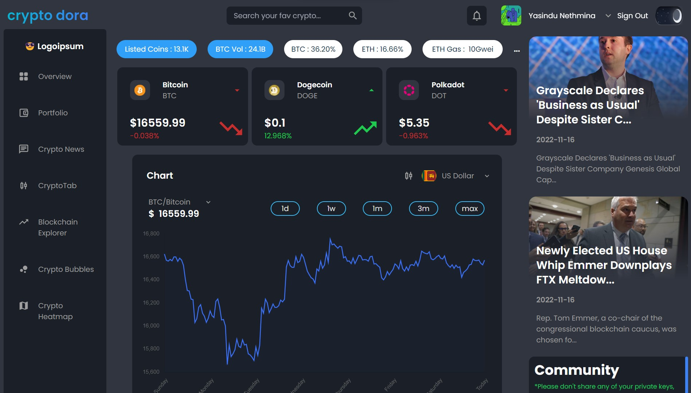

# CryptoDora - Realtime Crypto Charts, News, Alerts & Stats
 

#### Live Link: https://cryptodora-app.web.app/

# Tech Stack:

• React.js: A JavaScript library used to develop SPA applications.
 
• Tailwind CSS: A CSS framework for building user interfaces with utility-first styles.
 
• React Query: React fetching tool used for api chaining.
 
• React Router: A JavaScript library intergrated to react for page routing.
 
• Chart.js: Amazing tool for dynamic chart generation.
 
• Firebase: Realtime database used for hosting and authentication.
 
• Jest: Used for testing purposes.

# Features

• Check cryptocurrency prices with detailed charts
 
• Track your portfolio anywhere you go
 
• Read latest cryptocurrency news & alerts
 
• Crypto Heatmaps & bubbles to get an overall idea on the market
 
• ETH explorer to track your ethereum transactions
 

# Getting Started

To get started with the CryptoDora Project, follow these steps:
 
Clone the repository: git clone https://github.com/YasinduNethmina/CryptoDora-Crypto-App.git
Install the dependencies: npm install
Start the development server: npm start
The development server will start up and you can view the application at http://localhost:3000.

# Deployment

To deploy the CryptoDora to production, follow these steps:
 
Build the application: npm run build
Deploy the built application to your preferred hosting provider.

# Contributing

We welcome contributions to the project! If you have an idea for a new feature or have found a bug, please open an issue on the GitHub repository. If you would like to contribute code, please fork the repository and submit a pull request.

# License

The CryptoDora Project is licensed under the MIT License. See LICENSE for more information.
